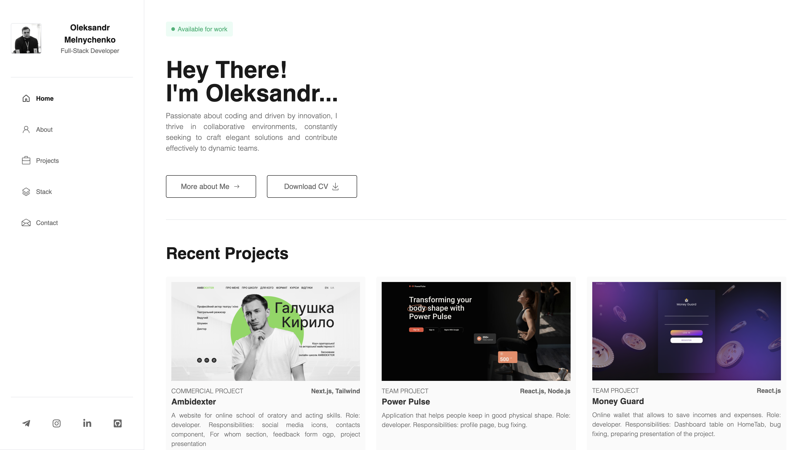

# My Portfolio

Welcome to my portfolio! This project contains information about me, my skills, projects I've worked on, and more. It will help you get to know me and my software development experience better.

## Overview

This is my personal portfolio website showcasing my skills, experience, and projects I've worked on. It's built using [Vite](https://vitejs.dev/) for lightning-fast development experience along with the following technologies:

- [React](https://react.dev/)
- [TypeScript](https://www.typescriptlang.org/)
- [TailwindCSS](https://tailwindcss.com/)
- [React Router](https://reactrouter.com/en/main)
- [Axios](https://axios-http.com/)
- [Formik](https://formik.org/)
- [Yup](https://github.com/jquense/yup)
- [Framer Motion](https://www.framer.com/motion/)
- [Telegram Bot API](https://core.telegram.org/bots/api)

## Features

- Personal Information: detailed information about me, my skills, and experience.
- Projects: a list of my projects with brief descriptions and links to them.
- Contact: ways to get in touch with me.

## Website Structure

The portfolio website is organized into several main sections:

1. **Home**: The landing page of the website, providing an introduction to me and my work.

2. **About**: This section contains detailed information about me, including my education, skills, and experience.

3. **Projects**: Here, you'll find a list of projects I've worked on, along with brief descriptions and links to view them.

4. **Stack**: In this section, I showcase the technologies and tools I'm proficient in, providing insights into my technical skills.

5. **Contact**: The contact section provides various ways to get in touch with me, such as through email or social media platforms or feedback form.

Each section is accessible via the navigation menu or through links/buttons throughout the website. The website aims to provide a comprehensive overview of my capabilities and experiences as a software developer.

## Getting Started

To run this project locally, follow these steps:

1. Clone this repository.
2. Install dependencies using `npm install`.
3. Start the development server using `npm run dev`.
4. Open your browser and navigate to `http://localhost:5173`.
